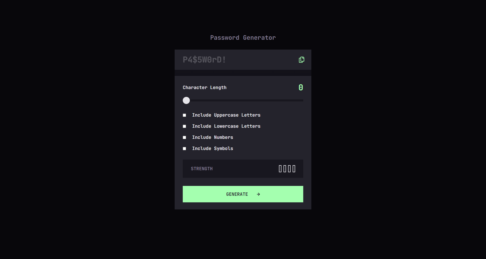

# GeniePass

GeniePass is a powerful password generator that helps you create strong and secure passwords. With GeniePass, you can rest assured that your passwords are strong enough to protect your online identity.

## Table of contents

- [Overview](#overview)
  - [Features](#features)
  - [Screenshot](#screenshot)
  - [Links](#links)
- [My process](#my-process)
  - [Built with](#built-with)
- [Author](#author)

## Overview

### Features

Users should be able to:

- **Customizable password length**: Create passwords of lengths up to 20 characters.
- **Randomization**: GeniePass uses a robust randomization algorithm to ensure that your passwords are truly unique and unpredictable.
- **Character sets**: Generate a password based on the selected inclusion options
- **Clipboard integration**: Copy your generated password to the clipboard for easy use.
- **Password strength analysis**: Get an instant assessment of your password's strength and security.

### Screenshot

### Links

- Solution URL: [Github Repository](https://github.com/simokitkat/Password-generator-app)
- Live Site URL: [Add live site URL here](https://your-live-site-url.com)

## My process

### Built with

- [React](https://reactjs.org/) - JS library
- [Typescript](https://www.typescriptlang.org/)
- [Vite](https://vitejs.dev/)
- CSS

## Author

- [My Personal Website](https://islam-soliman.netlify.app/)
- [Linkedin](https://www.linkedin.com/in/islamsoliman92)
